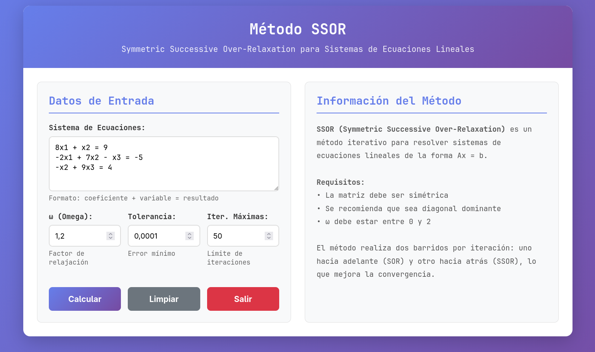

# Documentación Técnica

## Tabla de Contenidos

1. [Introducción](#introducción)
2. [Herramientas](#herramientas)
3. [Estructura del Proyecto](#estructura-del-proyecto)
4. [Documentación por Capas](#documentación-por-capas)
   - [Capa Control](#capa-control)
   - [Capa Interfaz](#capa-interfaz)
   - [Capa Método](#capa-método)
   - [Capa Traducción](#capa-traducción)
   - [Capa Servicios](#capa-servicios)
5. [Pantallazos](#pantallazos)
6. [Contribuciones](#contribuciones)
7. [Licencia](#licencia)

---

## Introducción

**SSOR (Symmetric Successive Over-Relaxation)** es un método iterativo utilizado para resolver sistemas de ecuaciones lineales de la forma:

```
Ax = b
```

### Requisitos del método

- La matriz **A** debe ser **simétrica**
- Se recomienda que sea **diagonal dominante**
- El parámetro de relajación **ω** debe estar entre **0 y 2**

### Funcionamiento

El método realiza **dos barridos por iteración**:

1. **Barrido hacia adelante** (SOR)
2. **Barrido hacia atrás** (SSOR)

Esto mejora notablemente la convergencia en comparación con métodos iterativos estándar como Gauss-Seidel o Jacobi.

---

## Herramientas

El proyecto utiliza las siguientes tecnologías:

- **Python (Flask)** – Backend y servicios REST
- **HTML, CSS, JavaScript** – Interfaz de usuario
- **PostgreSQL** – Base de datos relacional
- **Mermaid** – Diagramas de estructura

---

## Estructura del Proyecto

```
Proyecto SSOR/
│
├── main.py                          # Punto de entrada principal
├── README.md                        # Documentación del proyecto
│
├── capaControl/
│   └── control_de_flujo.py          # Coordinación entre capas
│
├── capaInterfaz/
│   ├── servidor.py                  # Servidor Flask
│   ├── static/
│   │   ├── css/
│   │   │   └── styles.css           # Estilos de la aplicación
│   │   └── js/
│   │       └── script.js            # Lógica del cliente
│   └── templates/
│       └── index.html               # Página principal
│
├── capaMetodo/
│   ├── ssor.py                      # Implementación del método SSOR
│   └── validaciones.py              # Validaciones de entrada
│
├── capaServicios/
│   ├── inicializar_bd.py            # Configuración inicial de BD
│   ├── servicio_bd.py               # Operaciones CRUD
│   ├── servicio_graficas.py         # Generación de gráficas
│   └── graficas/                    # Almacenamiento de gráficas
│
├── capaTraduccion/
│   └── parseador_ecuaciones.py      # Conversión de ecuaciones
│
└── Pantallazos/
    └── interfaz.png                 # Capturas de pantalla
```

### Diagrama de estructura

```mermaid
graph TB
    Root[📁 Proyecto SSOR]
    
    Root --> Main[main.py]
    Root --> README[README.md]
    Root --> Pantallazos[📁 Pantallazos]
    
    Root --> Control[📁 capaControl]
    Root --> Interfaz[📁 capaInterfaz]
    Root --> Metodo[📁 capaMetodo]
    Root --> Servicios[📁 capaServicios]
    Root --> Traduccion[📁 capaTraduccion]
    
    Control --> CF[control_de_flujo.py]
    
    Interfaz --> Servidor[servidor.py]
    Interfaz --> Static[📁 static]
    Interfaz --> Templates[📁 templates]
    
    Static --> CSS[📁 css]
    Static --> JS[📁 js]
    CSS --> StylesCSS[styles.css]
    JS --> ScriptJS[script.js]
    Templates --> Index[index.html]
    
    Metodo --> SSOR[ssor.py]
    Metodo --> Valid[validaciones.py]
    
    Servicios --> InitBD[inicializar_bd.py]
    Servicios --> ServBD[servicio_bd.py]
    Servicios --> ServGraf[servicio_graficas.py]
    Servicios --> Graficas[📁 graficas]
    
    Traduccion --> Parse[parseador_ecuaciones.py]
    
    Pantallazos --> InterfazPNG[interfaz.png]
    
    style Root fill:#2c3e50,stroke:#34495e,color:#ecf0f1
    style Control fill:#3498db,stroke:#2980b9,color:#fff
    style Interfaz fill:#3498db,stroke:#2980b9,color:#fff
    style Metodo fill:#3498db,stroke:#2980b9,color:#fff
    style Servicios fill:#3498db,stroke:#2980b9,color:#fff
    style Traduccion fill:#3498db,stroke:#2980b9,color:#fff
    style Static fill:#95a5a6,stroke:#7f8c8d,color:#fff
    style Templates fill:#95a5a6,stroke:#7f8c8d,color:#fff
    style CSS fill:#95a5a6,stroke:#7f8c8d,color:#fff
    style JS fill:#95a5a6,stroke:#7f8c8d,color:#fff
    style Graficas fill:#95a5a6,stroke:#7f8c8d,color:#fff
    style Pantallazos fill:#95a5a6,stroke:#7f8c8d,color:#fff
```



---

## Documentación por Capas

Este proyecto está construido de manera modular, con las siguientes capas:

### Capa Control

**Responsabilidad:** Coordinación y flujo de datos entre capas.

**Archivo principal:** `control_de_flujo.py`

**Funciones:**
- Gestiona las peticiones de la interfaz
- Coordina la comunicación entre el método SSOR y los servicios
- Valida el flujo de datos entre componentes

---

### Capa Interfaz

**Responsabilidad:** Presentación visual y experiencia de usuario.

**Componentes:**
- `servidor.py` – Servidor Flask que maneja las rutas HTTP
- `static/` – Recursos estáticos (CSS, JavaScript)
- `templates/` – Plantillas HTML

**Características:**
- Interfaz responsiva
- Validación de entrada en tiempo real
- Visualización de resultados y gráficas

---

### Capa Método

**Responsabilidad:** Implementación de algoritmos numéricos.

**Archivos:**
- `ssor.py` – Implementación del método SSOR
- `validaciones.py` – Validaciones matemáticas

**Funcionalidades:**
- Resolución de sistemas de ecuaciones lineales
- Verificación de condiciones de convergencia
- Cálculo de errores y tolerancias

---

### Capa Traducción

**Responsabilidad:** Conversión y adaptación de datos.

**Archivo principal:** `parseador_ecuaciones.py`

**Funciones:**
- Convierte ecuaciones en formato texto a estructuras matriciales
- Adapta los resultados del método para su presentación
- Transforma datos entre diferentes formatos

---

### Capa Servicios

**Responsabilidad:** Gestión de datos y servicios externos.

**Componentes:**
- `inicializar_bd.py` – Configuración inicial de la base de datos
- `servicio_bd.py` – Operaciones CRUD con PostgreSQL
- `servicio_graficas.py` – Generación de visualizaciones

**Servicios:**
- Persistencia de datos de sesiones
- Historial de cálculos
- Generación de gráficas de convergencia

---

## Pantallazos



*Interfaz principal del sistema SSOR*

---

## Contribuciones

Las contribuciones al proyecto son bienvenidas.

### Cómo contribuir:

1. **Fork** el repositorio
2. Crea una **rama** con tu nueva funcionalidad:
   ```bash
   git checkout -b feature/nueva-funcionalidad
   ```
3. Realiza tus cambios y haz **commit**:
   ```bash
   git commit -m "Añade nueva funcionalidad"
   ```
4. Envía un **pull request** con una descripción clara del aporte

### Lineamientos:

- Mantén el código limpio y documentado
- Sigue las convenciones de estilo del proyecto
- Incluye pruebas para nuevas funcionalidades
- Actualiza la documentación según sea necesario

---

## Licencia

Este proyecto está bajo licencia abierta. Consulta el archivo `LICENSE` para más detalles.

---

**Última actualización:** Diciembre 2024
